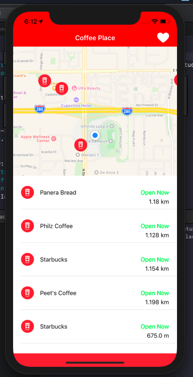

# CoffeePlace
Allow user to know about coffee Place near from where he is locate using Google API.
I used Swift 4.2 and Xcode 10 to build this app.

This app give you information about coffee place you can access to their website and call them through the app.
In real time you know if a place are closed , create your own list of favorites place.

# Requirements

You need to have Xcode 10 in your computer to test it.
I use Google Api to get all information about coffee place so you need to have an API key from Google.
To launch the project you have to open CoffePlace.xcworkspace through Xcode.

# Library and Framework 

Mapkit to get the map
CoreLocation to get the current position

I use Cocoapods to install the external libraries here is a list of what i use:

RealmSwift - to use persistency in my app it helps me saved the favortie place of the user.
RxRealm - I use this thin Wrapper of Realm to retrieve data from Realm
RxSwift - I use rx to help me build my MVVM Architecute by doing databinding
RxCocoa - I use it to bind my property with my Cocoa coponent to respect my MVVM Architecture

# Network Part

For the Network Part I decided to do it by hand without using Alamofire. I try to make a protocol oriented architecture to make it easier if i need to add new Webservice.
You can find hw i doing it in the NetworkManager repository.

# Model

I made my model conform to protocol Codable to allow me to parse JSON

# Test

I started to make some test using XCtestCase
